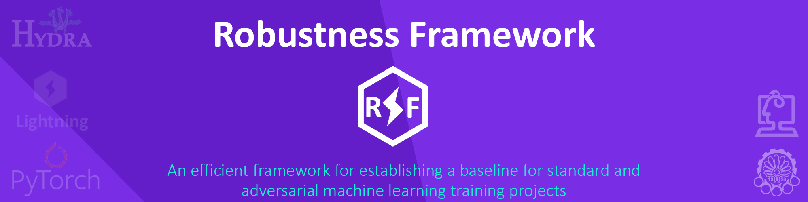

# Robustness Framework

<div align="center">



<br/>
<br/>

**A robustness framework for baseline of standard and adversarial machine learning research projects**

[](https://pypi.org/project/pytorch-lightning/)
[](https://badge.fury.io/py/pytorch-lightning)
[](https://anaconda.org/conda-forge/lightning)
[](https://choosealicense.com/licenses/mit/)  

</div>

The robustness framework is based on top-tier machine learning libraries based on Pytorch. Additionally, it allows for embedding different model architectures and training processes in addition to fixing all research issues.
This framework integrates the following libraries:
 * Pytorch-Lightning
 * Hydra
 * torchattacks

The following architectures are covered in this framework and other networks will be added as needed:
 * MKToyNet
 * LeNet
 * DenseNet
 * ResNet
 * WideResNet

The logging system of this framework is also customizable and resolves all your ideas. As a result, we can take advantage of the efficiency of the following libraries:
 * TorchMetrics 
 * Loggings
 * Neptune
 * Comet
 * MLFlow
 * ...

## Installation
To install this interesting framework for standard and adversarial machine learning, follow the steps below, and don't waste your time developing an efficient baseline.
For installing robustness framework, we have two approaches:

### 1- Manual installation
```
git clone https://github.com/khalooei/robustness-framework.git
pip install -r requirements.txt
```

### 2- Automatic installation
```
pip install robustness-framework
```


## Usage
You can just follow the `main.py` file as a main anchor of this framework. You can define your own configurations in `configs` directory as we defined `training_mnist.yaml` and `training_cifar10.yaml` configuration. 
You can run this framework for running on CIFAR10 dataset as below:
 ```
   python main.py +configs=training_cifar10
 ```

[TOBE COMPLETED]


## Acknowledgements
Thanks to the people behind Pytorch, Lightning, torchattacks hydra, and MLOps libraries whose work inspired this repository. Furthermore, I would like to thank my supervisors Prof. Mohammad Mehdi Homayounpour and Dr. Maryam Amirmazlagnani for their efforts and guidance.
